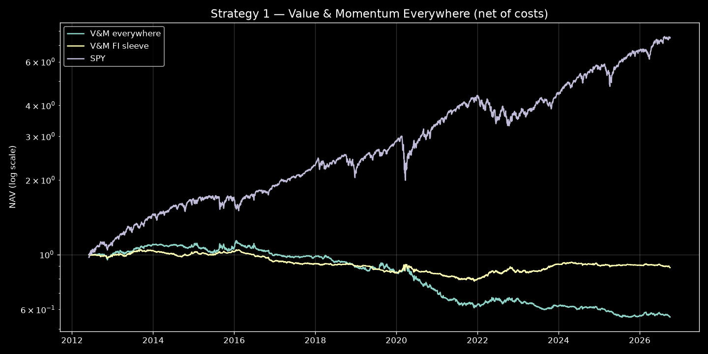
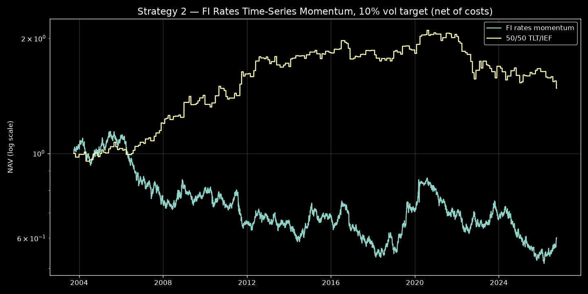

# os-quant — Phase 1 Backtest Report (2026-10-03)

*Systematic research engine: academic papers → tradable implementation → backtest → institutional stats.
All data free/keyless (Yahoo Finance, FRED-ready). Engine validated on synthetic data with a planted edge (Sharpe 3.93 — the machinery detects real effects).*

---

## Strategy 1 — "Value and Momentum Everywhere" (Asness, Moskowitz, Pedersen, JoF 2013)

Cross-sectional value (5y reversal) + momentum (12−1m), 50/50 z-scored combo,
long top tercile / short bottom tercile across 11 liquid ETFs, monthly rebalance,
1-day execution lag. Net of 10 bps one-way costs + 50 bps/yr stock borrow.

| Metric | Full book (2012-06 → 2026-10) | FI sleeve only |
|---|---|---|
| Total return | −44.05% | −11.50% |
| CAGR | −3.98% | −0.85% |
| Ann. vol | 6.98% | 4.07% |
| **Sharpe** | **−0.55** | **−0.19** |
| Sortino | −0.78 | −0.27 |
| Max drawdown | −51.0% (Jan 2016 → Oct 2025) | −25.4% (Sep 2013 → Dec 2021) |
| Calmar | −0.08 | −0.03 |
| Win rate (monthly / daily) | 41.0% / 48.7% | 45.7% / 48.9% |
| Win/loss ratio (monthly) | 0.86 | 1.00 |
| Profit factor | 0.60 | 0.84 |
| VaR 95 / 99 (1-day) | 0.69% / 1.24% | 0.37% / 0.63% |
| Beta / Alpha (ann.) vs SPY | −0.17 / −1.10% | −0.05 / −0.06% |
| Tracking error / IR | 20.5% / −0.94 | 17.9% / −0.91 |
| Avg monthly turnover | 47.7% of NAV | 42.6% of NAV |

Yearly returns, full book: 2013 +10.8%, 2020 −15.7%, 2021 −12.4%, 2022 +5.7%,
2023 −6.1%, 2024 −3.3%, 2025 −5.6%, 2026 YTD −1.3%.
FI sleeve: 2022 +9.4% (short duration into the hiking shock worked), 2023 +5.5%.

**Reading:** gross (pre-cost) Sharpe ≈ −0.02 — this is not a cost story. On this
11-ETF universe in 2012–2026 the factors are flat-to-negative. The value leg
structurally fights the mega-cap regime (short the strongest 5y names = US
large-cap growth; long the weakest = EM/duration-in-drawdown), and 3 names per
tercile gives almost no breadth diversification — the paper's result leans on
48 instruments across 8 classes. See `papers/value_momentum_everywhere.md`.

---

## Strategy 2 — FI rates time-series momentum (Moskowitz-Ooi-Pedersen 2012)

12−1m excess return of TLT over SHY → sign; vol-targeted to 10% (60d realized
vol, ±1.5x cap); monthly rebalance; 5 bps costs. Benchmark: monthly-rebalanced
50/50 TLT/IEF (Bloomberg UST index proxy).

| Metric | 2003-10 → 2026-10 (23.0y) |
|---|---|
| Total return | −39.95% |
| CAGR | −2.20% |
| Ann. vol | 11.44% |
| **Sharpe** | **−0.14** |
| Sortino | −0.21 |
| Max drawdown | −54.9% (Jun 2005 → Feb 2026) |
| Calmar | −0.04 |
| Win rate (monthly / daily) | 45.1% / 50.1% |
| Win/loss ratio (monthly) | 1.09 |
| Profit factor | 0.90 |
| VaR 95 / 99 (1-day) | 1.15% / 1.73% |
| Beta / Alpha (ann.) vs 50/50 TLT/IEF | 0.01 / −1.57% |
| Tracking error / IR | 13.9% / −0.26 |
| Avg monthly turnover | 38.3% of NAV |

Subperiods (gross): 2003–10 Sharpe −0.29; 2011–19 +0.03; 2020–26 −0.12.
Sign-flipped variant: +0.12 — the signal is weak noise, **not** inverted (verified).
Buy-and-hold TLT over the same span: Sharpe +0.27, CAGR +2.86%.

**Reading:** MOP's headline result is a *diversified* 58-market portfolio; a
single duration trade can't replicate that breadth. The 12m lookback whipsaws
at regime breaks (in 2022 the signal flipped long/short almost monthly — the
lookback still held the pre-hike rally when the selloff began). Vol-targeting
sizes down into the crash but can't fix a signal pointing the wrong way.
See `papers/fi_rates_momentum.md`.

---

## Honest caveats (applies to both)

- **ETF proxies, not futures.** No leverage, no carry/roll, ~5–15 bps/yr fee drag.
- **Survivorship:** the 11-ETF universe is today's liquid set; dead products
  (e.g. delisted country ETFs) are absent — mild upward bias on the equity sleeve.
- **Sample specificity:** 2012–2026 (S1) and 2003–2026 (S2) are single regimes;
  the papers' samples (1972–2011 / 1985–2009) differ enormously.
- **Costs are assumptions:** 10/5 bps one-way and 50 bps/yr borrow are
  liquid-market estimates, not measured slippage.
- **No multiple-testing correction.** These are two pre-registered constructions
  from the literature, not a mined backtest — that discipline is the point.

## What phase 1 established

1. The engine is **validated**: synthetic planted edge → Sharpe 3.93. Weak live
   results are the market's verdict, not implementation error.
2. Both flagship constructions **do not survive** the free-data ETF translation
   in these samples — documented with exact deviations from the papers.
3. The weekly pipeline now has a template: digest → implement → backtest →
   stats → report, with the 4-file strategy pattern (universe yaml + signal
   code + config + digest).

## Next papers for the weekly pipeline (proposed)

1. **Koijen, Moskowitz, Pedersen & Vrugt (2018), "Carry," JFE** — carry is the
   rates/FX value proxy that actually works; natural fix for the FI sleeve.
2. **MOP (2012) diversified TSMOM** — run time-series momentum across the full
   11-ETF panel instead of single-asset duration.
3. **Fama-French (2015) five-factor / Hou-Xue-Zhang q-factor** — needs
   fundamentals; pairs with adding a free fundamentals feed (SEC XBRL, already
   proven in os-bloom's universe builders).
